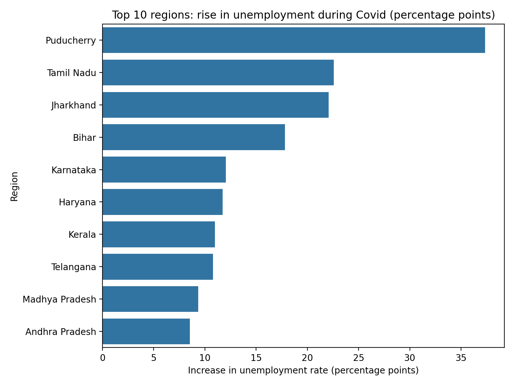

# Unemployment Analysis in India (with Covid-19 Impact)

Analysis of monthly unemployment rates across Indian states from May 2019 to
June 2020. Built for the CodeAlpha Data Science Internship (Task 2).

## Dataset
740 monthly records across 28 regions with Urban/Rural labels. Columns:
region, date, estimated unemployment rate, estimated employed, labour
participation rate, and area. File: `Unemployment in India.csv`.

## Data cleaning
- Removed 28 completely empty rows
- Stripped hidden whitespace from column names and text values
- Converted dates from text (day-month-year) to real datetime values
- Renamed long column names for readability
- Confirmed no missing values remain

## Key findings
- Unemployment held steady at about 9-10% from May 2019 to February 2020.
- After the national lockdown began on 25 March 2020, it more than doubled
  to roughly 24-25% in April and May 2020, then fell to about 12% in June.
- The rise differed sharply by region. Puducherry, Tamil Nadu, Jharkhand and
  Bihar saw the largest increases.
- Urban areas were hit harder than rural areas at the peak (about 25-28%
  against about 21-22%), though the two nearly converged by June.
- The data covers only 14 months, so true seasonal patterns cannot be
  established. A longer time series would be needed.

## Charts

## Policy implications
- Target relief at the hardest-hit regions rather than spreading it evenly.
- Urban job support matters, since urban unemployment peaked highest.
- Monthly monitoring can act as an early-warning system for economic shocks.

## Tools
Python, pandas, matplotlib, seaborn, Google Colab
